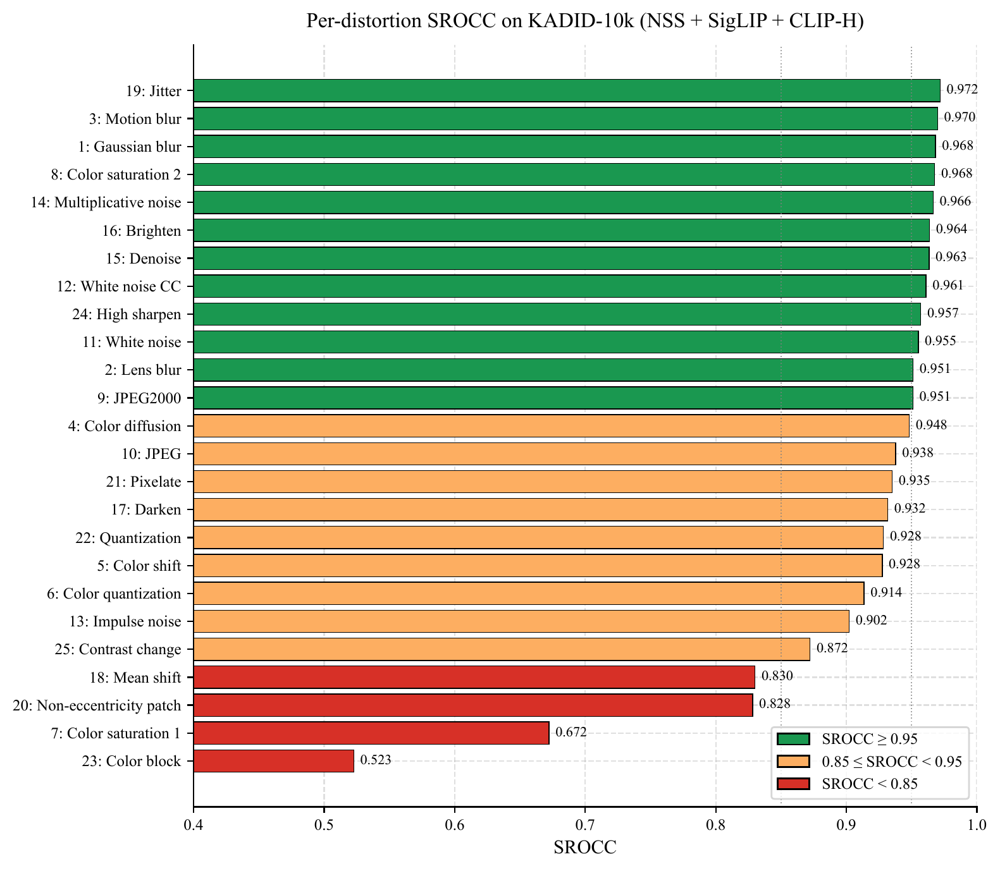
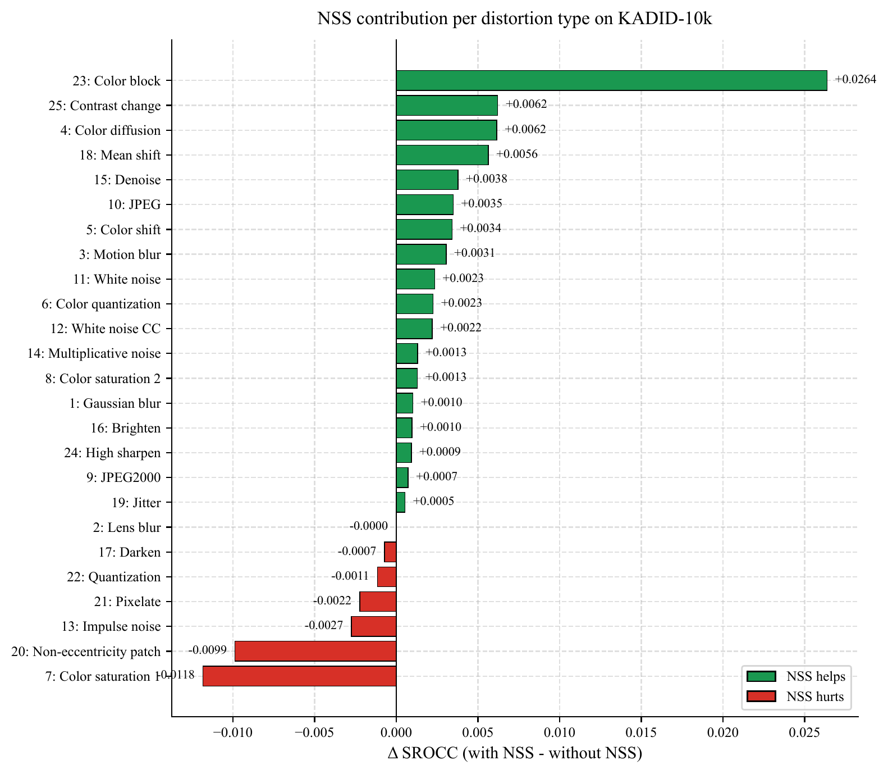
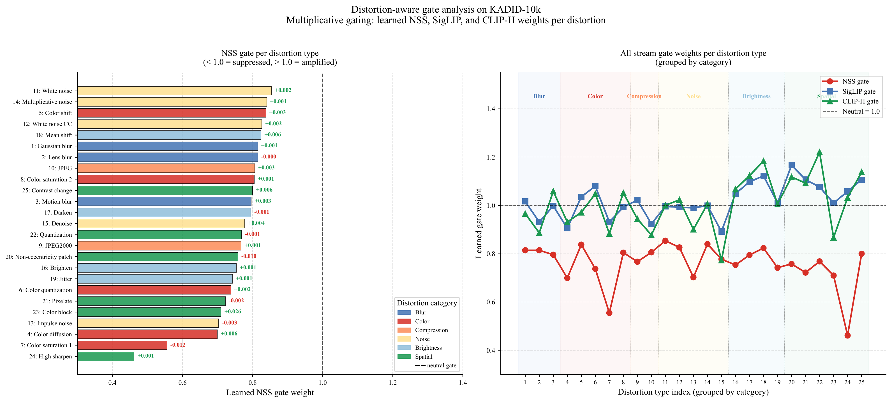

# Distortion-Aware Fusion of Statistical and Vision-Language Features for Blind Image Quality Assessment

**Bishr Omer Abdelrahman, Xu Li**  
Northwestern Polytechnical University, Xi'an, China

> *Submitted for publication. Preprint coming soon.*

---

## Overview

We propose a three-stream blind image quality assessment (BIQA) framework that combines:

- **NSS stream:** 138-dimensional natural scene statistics descriptor (spatial + spectral)
- **SigLIP stream:** ViT-SO400M-14-SigLIP-384 embeddings (1152D → 256D via PCA)
- **CLIP-H stream:** ViT-H-14 LAION-2B embeddings (1024D → 256D via PCA)

A lightweight **multiplicative gating network** learns per-input stream weights conditioned on image content. The gate values positively correlate (ρ = 0.33) with the per-distortion NSS contribution measured by independent ablation, providing interpretable cross-validation of the fusion design.

All VLM backbones are kept **entirely frozen**. Only the MLP regression head (~466,000 parameters) is trained, making the entire pipeline runnable on CPU after a one-time GPU feature extraction step.

---

## Results

| Dataset | SROCC | PLCC |
|---------|-------|------|
| KonIQ-10k | **0.9142** | **0.9279** |
| KADID-10k | **0.9715** | **0.9733** |
| LIVE-itW | **0.8527** | **0.8802** |

Our method achieves **state-of-the-art SROCC of 0.9715 on KADID-10k**, surpassing MANIQA (0.946), LIQE (0.930), and Q-Align (0.937).
### Per-distortion analysis on KADID-10k





### Distortion-aware gate analysis




---

## Installation

```bash
git clone https://github.com/bishr-omer/multimodal-biqa.git
cd multimodal-biqa
pip install -r requirements.txt
```

Tested on Python 3.11, CPU-only training. GPU required only for feature extraction.

---

## Usage

### Step 1: Extract NSS features

```bash
python extract_nss.py \
    --dataset koniq \
    --image_dir /path/to/koniq/images \
    --output_path features/koniq_nss.npy
```

Supported datasets: `koniq`, `kadid`, `liveitw`

### Step 2: Extract VLM features (requires GPU)

```bash
python extract_vlm.py \
    --dataset koniq \
    --image_dir /path/to/koniq/images \
    --output_dir features/ \
    --models siglip clip_h
```

This produces `koniq_siglip.npy` and `koniq_clip_h.npy` in the output directory.

Features are extracted once and cached. All subsequent training runs use the cached `.npy` files.

### Step 3: Train static fusion (main paper results)

```bash
# KonIQ-10k
python train_fusion.py --config configs/koniq.yaml

# KADID-10k
python train_fusion.py --config configs/kadid.yaml

# LIVE-itW (pretrain + finetune + ensemble)
python train_fusion_liveitw.py --config configs/liveitw.yaml
```

### Step 4: Train gating model

```bash
python train_gated.py --config configs/koniq.yaml
python train_gated.py --config configs/kadid.yaml
```

### Step 5: Evaluate

```bash
python evaluate.py \
    --predictions results/predictions/koniq_NSS_SigLIP_CLIPH.csv \
    --dataset koniq
```

---

## Ablation Results

### KonIQ-10k (5-fold CV)

| Configuration | SROCC | PLCC |
|---------------|-------|------|
| NSS only | 0.568 | 0.587 |
| SigLIP only | 0.891 | 0.908 |
| CLIP-H only | 0.882 | 0.900 |
| NSS + SigLIP | 0.903 | 0.919 |
| NSS + CLIP-H | 0.893 | 0.911 |
| SigLIP + CLIP-H | 0.910 | 0.924 |
| **All three** | **0.914** | **0.928** |

### KADID-10k (5-fold CV)

| Configuration | SROCC | PLCC |
|---------------|-------|------|
| NSS only | 0.898 | 0.898 |
| SigLIP only | 0.967 | 0.969 |
| CLIP-H only | 0.966 | 0.968 |
| NSS + SigLIP | 0.970 | 0.971 |
| NSS + CLIP-H | 0.969 | 0.970 |
| SigLIP + CLIP-H | 0.970 | 0.972 |
| **All three** | **0.972** | **0.973** |

---

## Repository Structure

```
multimodal-biqa/
├── extract_nss.py          # NSS feature extraction (CPU)
├── extract_vlm.py          # SigLIP + CLIP-H extraction (GPU)
├── train_fusion.py         # Static concatenation fusion, 5-fold CV
├── train_fusion_liveitw.py # Pretrain + finetune + ensemble for LIVE-itW
├── train_gated.py          # Multiplicative gating fusion
├── evaluate.py             # Compute SROCC / PLCC / KROCC
├── requirements.txt
├── configs/
│   ├── koniq.yaml
│   ├── kadid.yaml
│   └── liveitw.yaml
└── figures/
    ├── fig2_per_distortion_srocc.png
    ├── fig3_nss_contribution.png
    └── fig4_gate_analysis.png
```

---

## Pretrained Features

Precomputed features for all three datasets are available at:

> **[Google Drive link — coming soon]**

Download and place in the `features/` directory.

---

## Citation

If you find this work useful, please cite:

```bibtex
@article{adam2026distortion,
  title   = {Distortion-Aware Fusion of Statistical and Vision-Language
             Features for Blind Image Quality Assessment},
  author  = {Adam, Bishr Omer and Li, Xu},
  journal = {[journal name]},
  year    = {2026}
}
```

---

## Acknowledgements

This work was supported by [funding agency].  
VLM feature extraction uses [OpenCLIP](https://github.com/mlfoundations/open_clip)
and [Hugging Face Transformers](https://github.com/huggingface/transformers).
